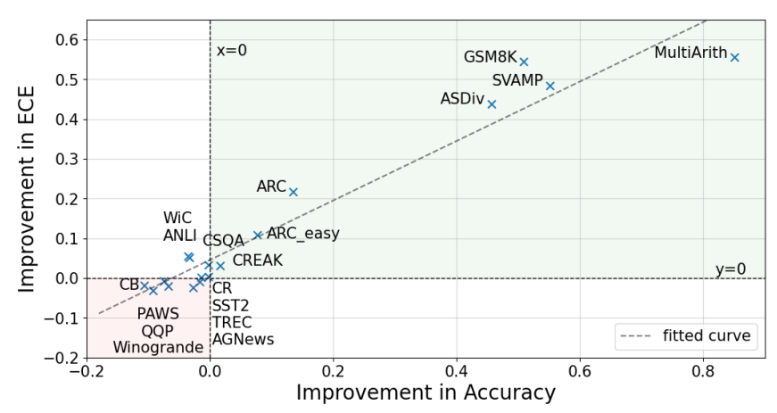

# Rationales Are Not Silver Bullets

Official code for the paper **Rationales Are Not Silver Bullets: Measuring the Impact of Rationales on Model Performance and Reliability**, which will be published in ACL 2025 Findings.

Through experiments on 18 datasets across 7 tasks, we found that incorporating rationales in the training dataset **does not always bring benefits** to model performance and reliability. Meanwhile, we found that the improvement in accuracy and calibration shows a **near linear correlation**, which is also **linearly correlated with task difficulties**.



P.S. The conclusion seems outdated, as this work was originally done at  **Jan 2024**, but it does provide insights on how we should construct our training data, and is highly consistent with recent works about efficient reasoning.


## To Reproduce the Results

### Step 1 - Download Raw Data

We need 18 datasets across 7 tasks, which we do not re-distribute here due to the variation of licenses. We simply list the sources here (most of them can be found on HuggingFace).

<details>
<summary>Datasets and Sources</summary>
<table>
  <tr><th>Datasets</th><th>Sources</th></tr>
  <tr><td>MultiArith</td><td>https://huggingface.co/datasets/ChilleD/MultiArith</td></tr>
  <tr><td>ASDiv</td><td>https://github.com/chaochun/nlu-asdiv-dataset</td></tr>
  <tr><td>SVAMP</td><td>https://huggingface.co/datasets/ChilleD/SVAMP</td></tr>
  <tr><td>GSM8K</td><td>https://huggingface.co/datasets/openai/gsm8k</td></tr>
  <tr><td>ARC Easy/Challenge</td><td>https://huggingface.co/datasets/allenai/ai2_arc</td></tr>
  <tr><td>CommonSenseQA</td><td>https://www.tau-nlp.sites.tau.ac.il/commonsenseqa</td></tr>
  <tr><td>CREAK</td><td>https://github.com/yasumasaonoe/creak</td></tr>
  <tr><td>CR</td><td>https://huggingface.co/datasets/SetFit/CR</td></tr>
  <tr><td>SST2</td><td>https://github.com/YJiangcm/SST-2-sentiment-analysis</td></tr>
  <tr><td>TREC</td><td>https://huggingface.co/datasets/CogComp/trec</td></tr>
  <tr><td>AGNews</td><td>http://groups.di.unipi.it/~gulli/AG_corpus_of_news_articles.html</td></tr>
  <tr><td>PAWS</td><td>https://github.com/google-research-datasets/paws</td></tr>
  <tr><td>QQP</td><td>https://quoradata.quora.com/First-Quora-Dataset-Release-Question-Pairs</td></tr>
  <tr><td>CommitmentBank</td><td>https://github.com/mcdm/CommitmentBank</td></tr>
  <tr><td>AdversarialNLI</td><td>https://github.com/facebookresearch/anli</td></tr>
  <tr><td>CommitmentBank</td><td>https://github.com/mcdm/CommitmentBank</td></tr>
  <tr><td>WiC</td><td>https://pilehvar.github.io/wic/</td></tr>
  <tr><td>Winogrande</td><td>https://huggingface.co/datasets/allenai/winogrande</td></tr>
  <tr><td>SUBJ (extra)</td><td>https://www.cs.cornell.edu/people/pabo/movie-review-data/</td></tr>
  <tr><td>CoinFlips (extra)</td><td>https://huggingface.co/datasets/skrishna/coin_flip</td></tr>
</table>
</details>


### Step 2 - Synthesize Rationales

First preprocess the raw data into jsonlines files, each line in the following format:

```json
{"id": "xxxx", "question": "xxxx", "label": "xxxx"}
```

That "question" should contains the question along with possible contexts like "options". For example, for natural language inference task, it should be:

```
Premise: some_premise
Hypothesis: some_hypothesis
Options: (A) Entailment (B) Contradiction (C) Neutral
```

Then run the following command:

```shell
python data/data_synthesize.py \
	--raw_data_path /path/to/the/preprocessed/data \
	--output_path /path/to/the/expected/output \
	--dataset_name /dataset/names \
	--num_threads 10 \
	--max_retries 10
```

Note that dataset_name should be one of the names  used in `data/task_instruction.json`. The model calling function is left blank in the code, which you should fill yourself.


### Step 3 - Model Training

After gaining synthesized data, you can train the models with or without rationales.  You can directly use the output file of the previous step for training.

At the time the training was conducted, we used codes modified from Stanford Alpaca based on vanilla HuggingFace Transformers.

We highly recommend you to train your models with newer frameworks like LLaMA Factory, Axolotl and so on, but if you want to use our code, run the following command:

```shell
export CUDA_VISIBLE_DEVICES=4,5,6,7
task=winogrande
rationale=True/False
ckpt_save_dir=/output/path

nohup python -m torch.distributed.launch --nproc_per_node=4 --master_port=29503 train.py \
    --model_name_or_path /path/to/your/model/ \
    --data_path /path/to/synthesized/data \
    --task_name ${task} \
    --rationale ${rationale} \
    --bf16 True \
    --output_dir ${ckpt_save_dir} \
    --num_train_epochs 3 \
    --per_device_train_batch_size 4 \
    --per_device_eval_batch_size 1 \
    --gradient_accumulation_steps 4 \
    --gradient_checkpointing True \
    --model_max_length 2048 \
    --evaluation_strategy "no" \
    --save_strategy "epoch" \
    --save_steps 1000 \
    --save_total_limit 100 \
    --learning_rate 5e-6 \
    --weight_decay 0. \
    --warmup_ratio 0.03 \
    --report_to "tensorboard" \
    --lr_scheduler_type "cosine" \
    --logging_steps 1 \
    --fsdp "full_shard auto_wrap" \
    --fsdp_transformer_layer_cls_to_wrap 'LlamaDecoderLayer' \
    --tf32 True \
    > log.txt 2>&1 &
```


### Step 4 - Evaluation

We use self-consistency style inference to get model confidence. Specifically, we generate 10 responses for each question, choose the one with the most appearances as the final answer and its appearance/10 as the  model confidence.

Run the following command to calculate the accuracy and calibration of a model on a task:

```shell
task_name=winogrande
python evaluate.py \
     --task ${task_name} \
     --test_data /path/of/test/set \
     --output_file /path/to/save/output \
     --rationale
```

Also, the model calling function is left blank in the code, which you should fill yourself.


## Citation

```latex
@misc{zhu2025rationalessilverbulletsmeasuring,
      title={Rationales Are Not Silver Bullets: Measuring the Impact of Rationales on Model Performance and Reliability}, 
      author={Chiwei Zhu and Benfeng Xu and An Yang and Junyang Lin and Quan Wang and Chang Zhou and Zhendong Mao},
      year={2025},
      eprint={2505.24147},
      archivePrefix={arXiv},
      primaryClass={cs.CL},
      url={https://arxiv.org/abs/2505.24147}, 
}
```

